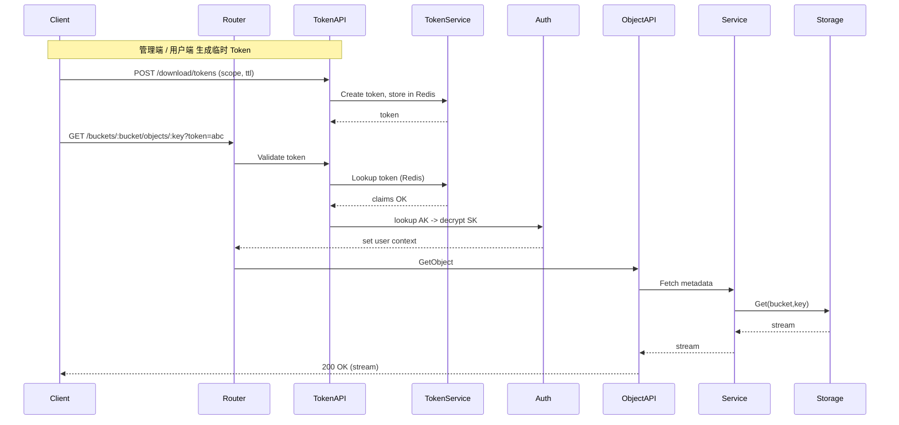

# 下载 Token 时序图


```mermaid
sequenceDiagram
    participant Client
    participant Router
    participant TokenAPI
    participant TokenService
    participant Auth
    participant ObjectAPI
    participant Service
    participant Storage

    Note over Client,TokenAPI: 管理端 / 用户端 生成临时 Token
    Client->>TokenAPI: POST /download/tokens (scope, ttl)
    TokenAPI->>TokenService: Create token, store in Redis
    TokenService-->>TokenAPI: token

    Client->>Router: GET /buckets/:bucket/objects/:key?token=abc
    Router->>TokenAPI: Validate token
    TokenAPI->>TokenService: Lookup token (Redis)
    TokenService-->>TokenAPI: claims OK
    TokenAPI->>Auth: lookup AK -> decrypt SK
    Auth-->>Router: set user context
    Router->>ObjectAPI: GetObject
    ObjectAPI->>Service: Fetch metadata
    Service->>Storage: Get(bucket,key)
    Storage-->>Service: stream
    Service-->>ObjectAPI: stream
    ObjectAPI-->>Client: 200 OK (stream)
```
```