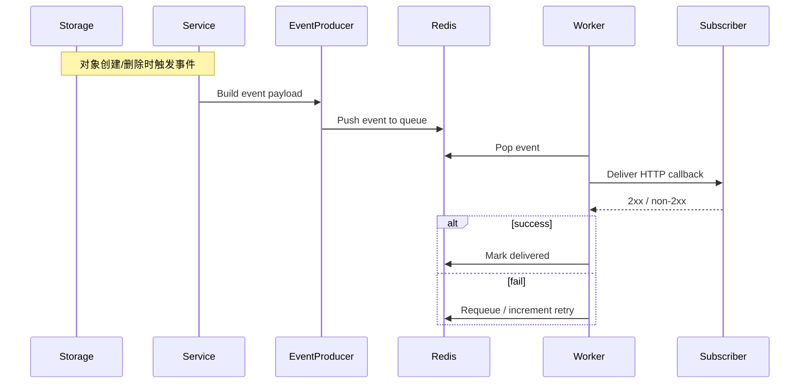

# 事件投递时序图


```mermaid
sequenceDiagram
    participant Storage
    participant Service
    participant EventProducer
    participant Redis
    participant Worker
    participant Subscriber

    Note over Storage,Service: 对象创建/删除时触发事件
    Service->>EventProducer: Build event payload
    EventProducer->>Redis: Push event to queue

    Worker->>Redis: Pop event
    Worker->>Subscriber: Deliver HTTP callback
    Subscriber-->>Worker: 2xx / non-2xx
    alt success
      Worker->>Redis: Mark delivered
    else fail
      Worker->>Redis: Requeue / increment retry
    end
```
```