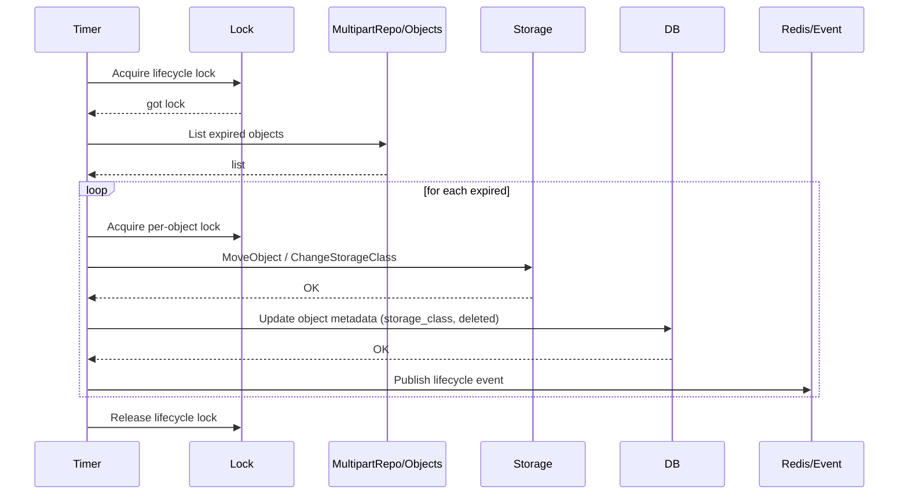

# 生命周期执行时序图


```mermaid
sequenceDiagram
    participant Timer
    participant Lock
    participant Repo as MultipartRepo/Objects
    participant Storage
    participant DB
    participant EventQueue as Redis/Event

    Timer->>Lock: Acquire lifecycle lock
    Lock-->>Timer: got lock
    Timer->>Repo: List expired objects
    Repo-->>Timer: list
    loop for each expired
      Timer->>Lock: Acquire per-object lock
      Timer->>Storage: MoveObject / ChangeStorageClass
      Storage-->>Timer: OK
      Timer->>DB: Update object metadata (storage_class, deleted)
      DB-->>Timer: OK
      Timer->>EventQueue: Publish lifecycle event
    end
    Timer->>Lock: Release lifecycle lock
```
```