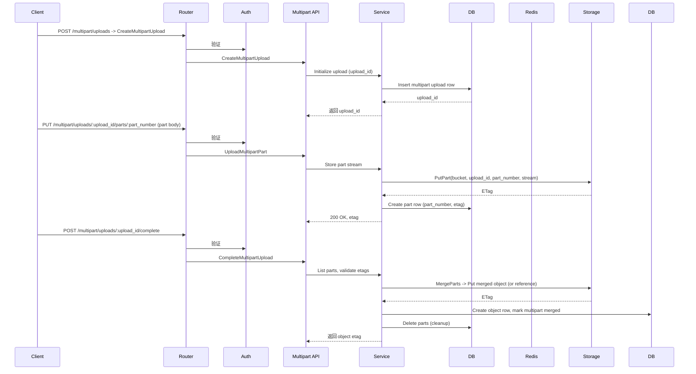

# 分片上传时序图


```mermaid
sequenceDiagram
    participant Client
    participant Router
    participant Auth
    participant API as Multipart API
    participant Service
    participant MultipartRepo as DB
    participant Redis
    participant Storage

    Client->>Router: POST /multipart/uploads -> CreateMultipartUpload
    Router->>Auth: 验证
    Router->>API: CreateMultipartUpload
    API->>Service: Initialize upload (upload_id)
    Service->>MultipartRepo: Insert multipart upload row
    MultipartRepo-->>Service: upload_id
    Service-->>API: 返回 upload_id

    Client->>Router: PUT /multipart/uploads/:upload_id/parts/:part_number (part body)
    Router->>Auth: 验证
    Router->>API: UploadMultipartPart
    API->>Service: Store part stream
    Service->>Storage: PutPart(bucket, upload_id, part_number, stream)
    Storage-->>Service: ETag
    Service->>MultipartRepo: Create part row (part_number, etag)
    Service-->>API: 200 OK, etag

    Client->>Router: POST /multipart/uploads/:upload_id/complete
    Router->>Auth: 验证
    Router->>API: CompleteMultipartUpload
    API->>Service: List parts, validate etags
    Service->>Storage: MergeParts -> Put merged object (or reference)
    Storage-->>Service: ETag
    Service->>DB: Create object row, mark multipart merged
    Service->>MultipartRepo: Delete parts (cleanup)
    Service-->>API: 返回 object etag
```
```