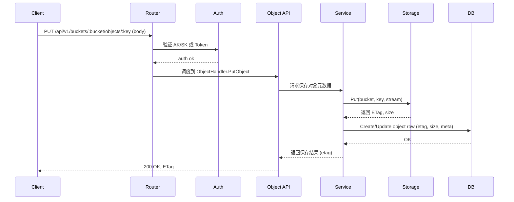

# 普通上传时序图


```mermaid
sequenceDiagram
    participant Client
    participant Router
    participant Auth
    participant API as Object API
    participant Service
    participant Storage
    participant DB

    Client->>Router: PUT /api/v1/buckets/:bucket/objects/:key (body)
    Router->>Auth: 验证 AK/SK 或 Token
    Auth-->>Router: auth ok
    Router->>API: 调度到 ObjectHandler.PutObject
    API->>Service: 请求保存对象元数据
    Service->>Storage: Put(bucket, key, stream)
    Storage-->>Service: 返回 ETag, size
    Service->>DB: Create/Update object row (etag, size, meta)
    DB-->>Service: OK
    Service-->>API: 返回保存结果 (etag)
    API-->>Client: 200 OK, ETag
```
```