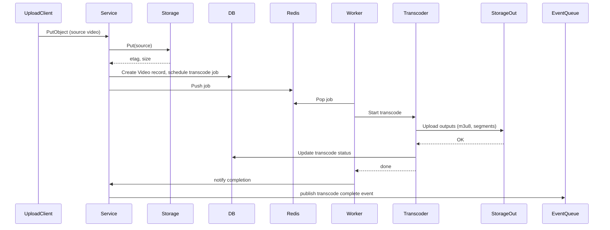

# 视频转码时序图


```mermaid
sequenceDiagram
    participant UploadClient
    participant Service
    participant Storage
    participant DB
    participant TranscodeQueue as Redis
    participant Worker
    participant Transcoder
    participant StorageOut

    UploadClient->>Service: PutObject (source video)
    Service->>Storage: Put(source)
    Storage-->>Service: etag, size
    Service->>DB: Create Video record, schedule transcode job
    Service->>TranscodeQueue: Push job

    Worker->>TranscodeQueue: Pop job
    Worker->>Transcoder: Start transcode
    Transcoder->>StorageOut: Upload outputs (m3u8, segments)
    StorageOut-->>Transcoder: OK
    Transcoder->>DB: Update transcode status
    Transcoder-->>Worker: done
    Worker->>Service: notify completion
    Service->>EventQueue: publish transcode complete event
```
```